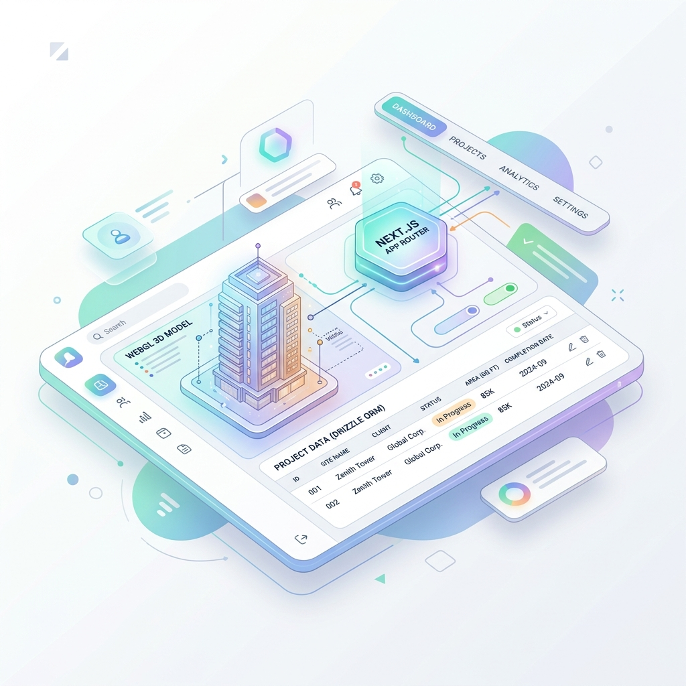
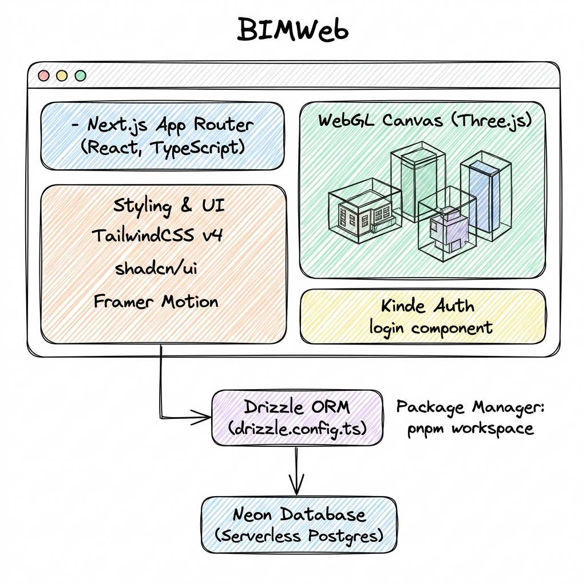

# BIMWeb: Human-in-the-Loop 3D Convergence

## The Breakthrough
The final hurdle in realizing the value of the BIMRAG ecosystem is the user experience. Raw JSON outputs and terminal logs, no matter how accurate, fail to provide actionable context for architectural or engineering workflows.

**BIMWeb** is the convergence point where state-of-the-art AI research meets human-in-the-loop validation. It is a modern web application that physically maps the extracted data, relationships, and Tri-Modal search results directly onto 3D building models.

## Ecosystem Integration
BIMWeb serves as the primary interface for the BIMRAG platform. When a user asks a complex query:
1. The request flows through the **BIMCloud** edge gateway.
2. The **BIMAgent** orchestrates the deep research.
3. The **BIMIndex** retrieves the exact structural coordinates.
4. **BIMWeb** renders the results in the browser, highlighting exact bounding boxes and components on the WebGL (three.js) canvas.



### Tech Stack & System Architecture


This architecture bridges the gap between abstract AI reasoning and tangible, visual engineering data.

## Tech Stack

| Layer | Technology |
|---|---|
| **Framework** | Next.js 16 (App Router) |
| **Language** | TypeScript (Strict Mode) |
| **Styling** | Tailwind CSS v4 + shadcn/ui |
| **3D Rendering**| three.js (WebGL) |
| **Database** | Neon Postgres + Drizzle ORM |
| **Auth** | Kinde OAuth |

## Features

- **3D BIM Viewer** — Full-screen viewer at `/dashboard/projects/[id]/models/[modelId]` supporting glTF and IFC formats, with measurement tools, section planes, dynamic model tree, keyboard shortcuts, and screenshot
- **Projects** — Create, edit, share, and manage BIM projects with search, sort, and grid/table views
- **Research** — Multi-mode search (Smart/Keyword/Semantic/Relationships) with grounded answers and source citations
- **Documents & Ingestion** — Upload PDFs and documents; pipeline status tracking (queued/parsing/indexing/ready)
- **Team Collaboration** — Role-based access control (admin/editor/viewer), email invites, acceptance flow
- **API Keys** — Generate and manage per-user API keys with scope-based access and rate limiting
- **Audit Log** — Track all activity with filters, expandable metadata, CSV/JSON export
- **Platform Health** — Monitor BIMAgent, BIMIndex, BIMExtract, and BIMCloud services; run test queries via the gateway
- **Public REST API** — Full v1 API at `/api/v1/*` with per-user key auth; interactive OpenAPI 3.1 docs at `/api/docs` (Scalar UI)
- **Multi-Tenant Workspaces** — Isolated workspaces with per-user data boundaries

## Getting Started

```bash
# Install dependencies
pnpm install

# Setup environment variables
cp .env.local.example .env.local

# Run checks
pnpm test   # 192 passing Vitest tests (16 files)
pnpm lint   # 0 errors
pnpm build  # production build (30 routes)

# Run the development server
pnpm dev
```

## Quick Commands

| Command | Purpose |
|---|---|
| `pnpm dev` | Start development server |
| `pnpm build` | Production build |
| `pnpm lint` | ESLint check (0 errors expected) |
| `pnpm test` | Run Vitest unit/component tests |
| `pnpm exec tsc --noEmit` | TypeScript type-check |
| `pnpm drizzle-kit generate` | Generate new migration |
| `pnpm drizzle-kit push` | Push schema to Neon DB |

## API Documentation

A REST API is available at `/api/v1/*` with endpoints for projects, models, team, search, documents, and audit. Authentication is via API keys (manageable at `/dashboard/api-keys`).

- **Interactive Scalar UI**: `/api/docs`
- **OpenAPI 3.1 spec JSON**: `/api/v1/openapi`

## Testing

192 tests across 16 files covering:
- RBAC (27 tests), sharing (17), storage (15), workspace (8), api-keys (29)
- IFC parser (14), server actions (26), audit logging (4), ecosystem API clients (18)
- Component RTL tests: EmptyState, ConfirmDialog, StatCard, SegmentedTabs (31)
- Smoke/export tests (2)

Playwright E2E specs are designed for 12 primary journeys; `@playwright/test` is installed but E2E requires a live environment in CI.

## Database migrations

Migration `0002_narrow_lady_ursula` adds workspaces, API keys, audit logs, documents, and related columns. The SQL is committed under `src/db/migrations/`; it is **not applied automatically**.

| Step | Command |
|---|---|
| Check status (requires `DATABASE_URL` in `.env.local`) | `./scripts/check-migration.sh` or `pnpm db:check` |
| Apply via Drizzle migrate | `pnpm db:migrate` |
| Push schema directly (review diff first) | `pnpm db:push` |

Without `DATABASE_URL`, `pnpm db:check` prints setup steps and exits non-zero. Never commit `.env.local`.

## Deployment (Vercel)

Production deploys run via `.github/workflows/cd.yml` on pushes to `main`.

Configure GitHub Actions secrets:

| Secret | Purpose |
|---|---|
| `VERCEL_TOKEN` | Vercel personal/team token |
| `VERCEL_ORG_ID` | Vercel team or user id |
| `VERCEL_PROJECT_ID` | Linked Vercel project id |

Mirror runtime environment variables on the Vercel project (`DATABASE_URL`, `KINDE_*`, service URLs, optional S3/Upstash). Do not commit secrets to the repository.
